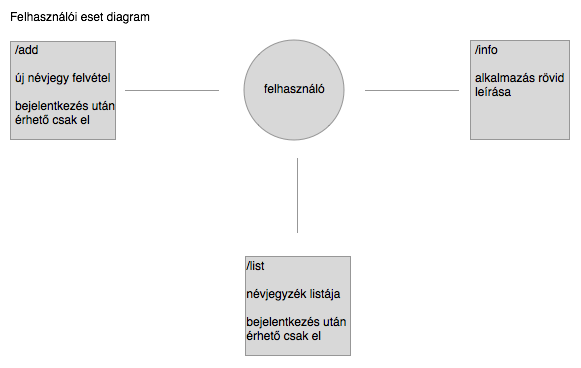
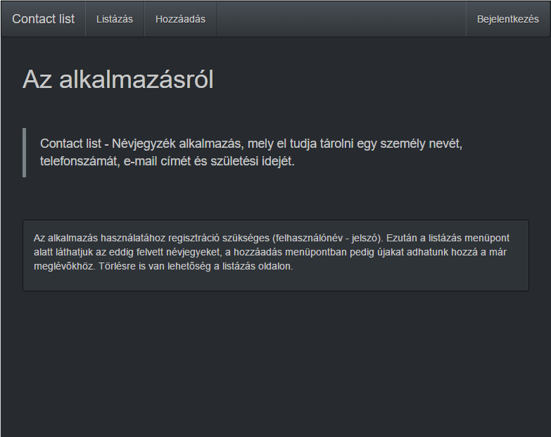

# ContactList
Névjegyzék személyek adatainak (telefonszám, email cím, születési idő) tárolására

>Készítette: Madroszkiewicz Márk - B8K1V5 - madromark@inf.elte.hu

##Követelményanalízis

Funkcionális elvárások: 

- regisztráció
- bejelentkezés
- névjegyek tárolása
  - név
  - telefonszám
  - email cím
  - születési idő
- névjegyek törlése

##Használatieset-modell
- Szerepkör: felhasználó
- Használati eset diagram: 
- Folyamatok pontos menete: 
Alkalmazás megnyitása, majd bejelentkezés menüpont (ha még nem regisztrált felhasználó, akkor regisztrálás a lap alján). Listázás menüpont sikeres autentikáció után kilistázza a felhasználóhoz tartozó névjegyeket. Új névjegy felvételéhez a hozzáadás menüpontot kell megnyitnunk. Törlésre és keresésre a listázás oldalon van lehetőség.

##Tervezés
Oldaltérkép, végpontok: 

Design: 

###Osztálymodellek
User model egy felhasználót valósít meg a következő adattagokkal:
- username / felhasználónév
- password / jelszó
- surname / keresztnév
- forename / vezetéknév
- contacts / hozzá tartozó névjegyzék

Contact model egy névjegyet valósít meg:
- nev
- telszam
- mail
- szuldatum

##Implementáció
###Fejlesztői környezet
c9.io online IDE

###Könyvtárstruktúrában lévő mappák
contactlist
- models  //osztálymodellek
- node_modules  /node csomagok
- views  //megjelenítésért felelős fileok
  - auth  //autorizációval kapcsolatos oldalak
  - partials  //minden egyéb megjelenő design darab

##Tesztelés
Selenium IDE segítségével 4 előre elkészített teszt esettel.
- Regisztráció -
Regisztrál selenium/selenium felhasználónév jelszó párossal az oldalon, majd ha a regisztráció után a Hozzáadás oldalra kerülünk a teszt sikeres.
- Belépés -
Az első tesztesetnél regisztrált userrel a belépés tesztelése.
- Új névjegy létrehozása, majd törlése
- Regisztrációt teszteli üres felhasználónév és jelszó mezővel, hibát kell kapnia.

##Felhasználói dokumentáció
###Futtatáshoz ajánlott szoftver
Google Chrome, Firefox

###Program használata
Nyissuk meg az alkalmazást és jelentkezzünk be, vagy regisztráljunk, ha még nincs felhasználónk az alkalmazásban.
Ezután elérhetővé válik a Listázás és Hozzáadás menüpont. Előbbi kilistázza a már felvett névjegyeket, utóbbival pedig újakat tudunk felvenni.
Törölni a listázás oldalon lehet az adott névjegy törlés gombjára kattintva.
